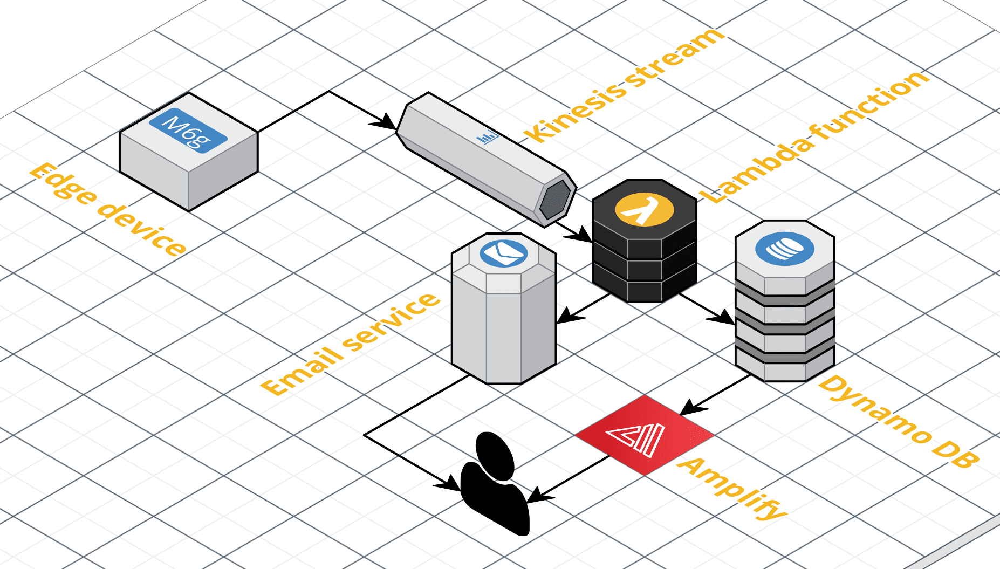
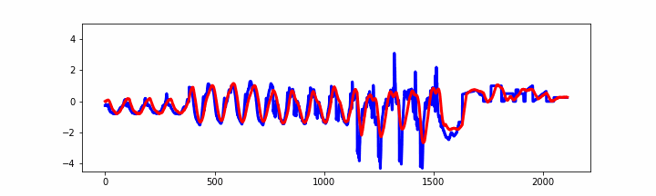

# SenseAnomali - environmental-hackathon
https://environmentalhack.com/

> ### [Final Submission File](final_submission/submission.txt)
> ### [Video](https://www.youtube.com/watch?v=CY4-QuQNhxo&amp;feature=youtu.be)
> ### [Slides](https://docs.google.com/presentation/d/1Qvy8_xniuiOyBV1pXJushagHXjqmz9sy5S_nMROaBqY/edit?usp=sharing)

# Demo Link
https://d8z2jjw1flsqp.cloudfront.net/

# Architecture

# Results

